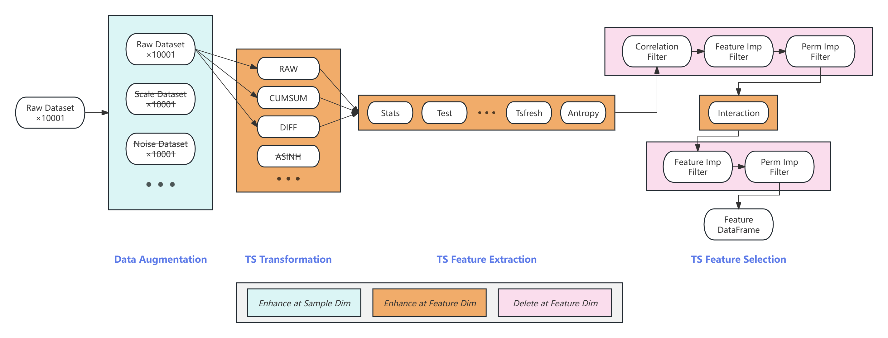

# Lightweight Data Science Competition Workflow (For ADIA Lab Structural Break)

[中文版本](README-zh.md) | English

## TL;DR

This Repo is written for illustrating the pipeline we built for the ADIA Lab Structural Break Competition. View our Notion document for a detailed feature engineering solution.  
[Solution](https://messy-plain-a65.notion.site/ADIA25-211402a1a1b780428471eaed714e285b?source=copy_link)



> `experiment/` is the experimental pipeline for ML methods, `submit_onlinetrain.ipynb` is the notebook used to submit online-trained models (LB AUC 88.60%). In addition, `UTime.py` and `PatchCrossEncoder.py` are attempts using DL methods (with poor CV scores).

## 1. Core Philosophy

This workflow is tailored for fast-paced data science competitions, with the core principles of **rapid iteration** and **result traceability**. When used with git, it ensures that every experiment's feature set and model can be versioned, rolled back, and shared.

*   **Feature Set Evolution**: We don't maintain a single "master" feature file, but record every step of the experiment by generating a series of timestamped feature files. The latest file represents the current optimal feature set.
*   **Version as File**: Each feature file (`features_YYYYMMDD_HHMMSS.parquet`) is an independent version. To rollback or compare, simply specify different file names in commands.
*   **Automated Logging**: All operations (feature generation/deletion, model training) generate timestamped, independent log files. Successful training logs are automatically renamed with CV scores for quick identification.
*   **Output Isolation**: Each training session's outputs (models, OOF predictions, logs, metadata) are saved in independent folders named with timestamps and CV scores, ensuring clear and unambiguous experiment results.

---

## 2. Project Structure

```
ADIA-Lab-Structural-Break/
├── experiment/                   # Main experiment module
│   ├── config.py                 # Configuration file
│   ├── data.py                   # Data loading and preprocessing
│   ├── features.py               # **All active feature function definitions**
│   ├── features_deprecated.py    # **Deprecated or failed feature functions**
│   ├── filter.py                 # Feature filtering
│   ├── interactions.py           # Feature interactions
│   ├── model.py                  # Experimental model definitions
│   ├── train.py                  # Training and evaluation (with augmented data cross-validation)
│   ├── main.py                   # Main program entry point
│   ├── utils.py                  # Utility functions
│   ├── logs/                     # Log files
│   │   ├── feature_logs/         # Feature engineering logs
│   │   └── training_logs/        # Training logs
│   └── output/                   # Output results (by timestamp and AUC)
├── submit_onlinetrain.ipynb      # Submission file
├── requirements.txt              # Dependencies
├── .gitignore                    # Git ignore file
└── README.md                     # Project documentation
```

---

## 3. Workflow Instructions

#### Step 1: Data Augmentation (Optional - we haven't found augmentation methods that improve model performance)

In the `experiment/data.py` file, add data augmentation functions and mark them with the `@register_data_enhancement` decorator.

```bash
# Generate all registered augmented data
python -m experiment.main data-aug
```

Then in `experiment/config.py`, add the decorator IDs of data augmentation functions to the `ENHANCEMENT_IDS` list, which marks which augmented data will generate features in the `gen-feats` command.

> Through data augmentation, we can increase the number of training samples (= original dataset count * number of augmentations).

#### Step 2: Signal Transformation and Feature Engineering

In the `experiment/features.py` file, add signal transformation functions and mark them with the `@register_transform` decorator for additional transformations on original signals.  
In the `experiment/features.py` file, add feature functions and mark them with the `@register_feature` decorator to extract features from original and transformed signals.

```bash
# Apply all registered transformations to all original and augmented data, then generate all registered features
python -m experiment.main gen-feats
```

> Through signal transformation and feature engineering, we can increase training sample feature dimensions (= number of transformations * number of features).

> Additional Notes
> 1. Generated feature files are saved in the `feature_dfs/` directory with filenames like `features_YYYYMMDD_HHMMSS.parquet`, `features_YYYYMMDD_HHMMSS_id_{x}.parquet`. Files without ID suffix record feature metadata, files with ID suffix contain features for corresponding augmented data, where `id_0` represents original data features.
> 2. Run the `gen-feats` command with `--trans` and `--funcs` parameters to specify transformation functions and feature functions to run. This helps add more features based on the latest feature file in feature_dfs/.
> 3. If you're unsure whether a feature is effective, you can first add it to the `EXPERIMENTAL_FEATURES` list in `experiment/config.py`. This way, the default `gen-feats` command will skip it. It will only be generated when you explicitly specify it through the `--funcs` parameter. This helps maintain stability of the main feature set.

#### Step 3: Filtering

Use the `REMAIN_FEATURES` list in `experiment/config.py` to manage which features should be used for further training (filtering operations will output appropriate result files containing feature lists for various thresholds).

After generating features, perform correlation removal. Filtering results are presented in `./experiment/output/filter_{xxx}` where `{xxx}` is the feature filename (without extension).

```bash
# Perform correlation filtering
python -m experiment.main filter corr
```

After training, use feature importance / permutation importance to filter features. Please specify the training version, and filtering results will be saved in `./experiment/output/filter_{xxx}`.

```bash
# Perform feature importance filtering
python -m experiment.main filter feature-imp --train-version xxx
# Perform permutation importance filtering
python -m experiment.main filter perm-imp --train-version xxx
```

#### Step 4: Create Interactions

Specify features to interact with in the `TOP_FEATURES` list in `experiment/config.py`. The `gen-interactions` command will automatically generate interaction terms for these features. Use parameters like `--sqmul --add --sub --div` to specify the types of interaction terms to generate.

```bash
python -m experiment.main gen-interactions --sqmul --add --sub --div
```

#### Step 5: Training

Run the `train` command directly. The script will automatically find and use the latest feature file in the `feature_dfs` directory for training.

```bash
# Automatically use the latest feature set for training
python -m experiment.main train --train-data-ids 0 --perm-imp --save-model --save-oof
```

*   `--train-data-ids 0 1 2`: Specify data IDs for training, can accept multiple values, default is ID `0` for original dataset.
*   `--perm-imp`: Calculate permutation importance.
*   `--save-model`: Save trained model files.
*   `--save-oof`: Save OOF (Out-of-Fold) prediction results.

#### Step 6: Evaluate Results

After training completes, check the CV score in terminal output. You can also see results in the file system:

1.  **Output Folder**: A new folder will appear under `experiment/output/`, e.g., `train_20250707_140000_auc_0.69000`.
2.  **Success Log**: The corresponding training log under `experiment/logs/` will be renamed, e.g., `train_20250707_140000_auc_0.69000.log`. The log contains **total training time** and **complete list of features used**.

#### Step 7: Decision and Synchronization

*   **Successful Experiment (CV score improvement)**:
    1.  **Confirm**: If it was previously an experimental feature, remember to remove it from the `EXPERIMENTAL_FEATURES` list in `config.py` to make it a core feature.
    2.  **Sync**: `git add`, `git commit`, `git push` the relevant files you modified in the `experiment/` directory.

*   **Failed Experiment (CV score decline)**:
    1.  **Archive Code**: Cut and paste the failed feature function code from `features.py` completely into the `experiment/features_deprecated.py` file, and **remove the `@register_feature` decorator** from the function header.
    2.  **Clean Feature Files**: Use the `del-feats` command to remove these failed feature columns from the latest feature file.
        ```bash
        # Assuming the latest file is ...12345.parquet, and features to delete are generated by new_awesome_feature function
        python -m experiment.main del-feats --base-file features_...12345.parquet --funcs new_awesome_feature
        ```
    This generates a cleaner new version feature file without failed features, and your workspace is rolled back accordingly.

---

## 4. How to Rollback / Experiment Based on Old Versions

If the latest feature set doesn't perform well and you want to revert or experiment based on a historical version, it's very simple.

Assume `features_20231028_120000.parquet` is a known, well-performing version.

*   **Use it only for training**:
    ```bash
    python -m experiment.main train --feature-file experiment/feature_dfs/features_20231028_120000.parquet
    ```

*   **Add new features based on it**:
    ```bash
    python -m experiment.main gen-feats --funcs another_new_idea --base-feature-file experiment/feature_dfs/features_20231028_120000.parquet
    ```
    This reads the specified old file, adds the `another_new_idea` feature, then generates a completely new feature file without affecting any existing files in `feature_dfs`.

---

## 5. Version Tracking and Reproduction

**Any training result is 100% reproducible.**

If you see a high-scoring result in the `output` directory, e.g., `20231029_180000_cv_0.82000`, and want to know how it was achieved:

1.  Find the corresponding log file `experiment/logs/train_20231029_180000_cv_0.82000.log`.
2.  Open the log file, which clearly records all information:
    *   **Feature file used**: The log will have a line `INFO - Training with feature file: experiment/feature_dfs/features_xxxxxxxx_xxxxxx.parquet`.
    *   **Model parameters**: The log records all model hyperparameters used in this training session.

---
## 6. Command Reference

*   **Generate Features**: `python -m experiment.main gen-feats [--funcs <func_name_1> ...]`
    *   `--funcs`: Specify one or more feature functions to generate. **If omitted, generates all non-experimental features**.
    *   `--base-file <filename>`: Specify a base feature filename for updates, defaults to latest.

*   **Delete Features**: `python -m experiment.main del-feats --funcs <func_name_1> --cols <col_name_1> ... --base-file <filename>`
    *   `--funcs`: Specify feature **function names** to delete. The script will automatically find and delete all columns generated by that function.
    *   `--cols`: Specify feature **column names** to delete.
    *   `--base-file <filename>`: **Must** specify the base feature filename to operate on.

*   **Model Training**: `python -m experiment.main train`
    *   `--feature-file <path>`: Specify feature file for training, defaults to latest.
    *   `--save-model`: Flag, whether to save model files.
    *   `--save-oof`: Flag, whether to save OOF prediction files.